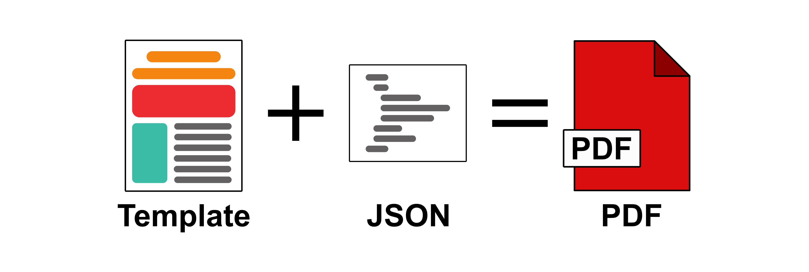

## EasyDocs

Templated PDF generation.

### Table of Contents

[TOC]

### Under the Hood

[PDFKit](https://pdfkit.org): renders native elements to the PDF document.

[SVG-To-PDFKit](https://www.npmjs.com/package/svg-to-pdfkit): renders SVG images to the PDF document.

### Components

### Properties

### Custom Fonts

### Header

### Footer

### Charts

Charts can be included into the PDF document by including the chart as an image. Chart images can be generated by using some of the chart-to-image services listed below:

- Image Charts (https://www.image-charts.com/)
- Quick Chart (https://quickchart.io/)
- Chart Works (https://www.chartworks.io/charts/image)

An example of including a chart into a PDF can be found [here](link/to/chart-example.js).

### Pitfalls

### Roadmap

