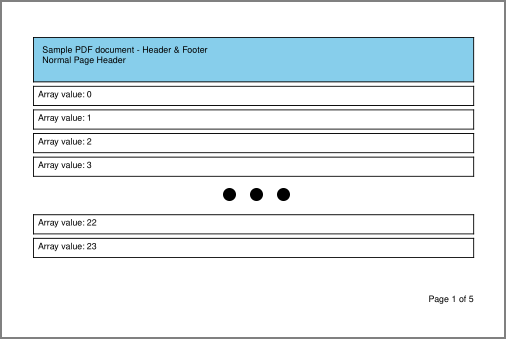
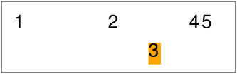
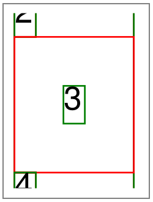

## EasyDocs

   [](https://www.paypal.com/donate/?hosted_button_id=BVBKNU8NHN2UN)


    [](https://www.paypal.com/donate/?hosted_button_id=BVBKNU8NHN2UN)


### About

If you ever had to create a PDF document you would be familiar with the struggles to get headers, footers, and tables to layout correctly. This library aims to remove the complexity of creating PDF documents by providing purpose built components that handle rendering and data binding.

### Installation

**NodeJS**

```
npm install reply-pdf
```

**Web**

```
Web installation not available yet
```

### Under the Hood

[PDFKit](https://pdfkit.org): renders native elements to the PDF document.

[SVG-To-PDFKit](https://www.npmjs.com/package/svg-to-pdfkit): renders SVG images to the PDF document.

### Components


#### BaseComponent

[BaseComponent](./src/components/base-component.js) registers properties and functions shared by all components

Hierarchy: `BaseComponent`

| Property  | Type   | Description                                                  |
| --------- | ------ | ------------------------------------------------------------ |
| `binding` | string | Property of the provided data object to use as data source for bindings |
| `debug`   | bool   | Indicates whether the component should render rectangles for outline and margin |

#### BaseLayoutComponent

[BaseLayoutComponent](./src/components/base-layout-component.js) registers properties and functions shared by all components that have a physical layout on the document.

Hierarchy: `BaseComponent / BaseLayoutComponent`

| Property            | Type            | Description                                  |
| ------------------- | --------------- | -------------------------------------------- |
| `width`             | number          | Width available to render content            |
| `height`              | number          | Height available to render content           |
| `x`                   | number          | Horizontal content offset                    |
| `y`                   | number          | Vertical content offset                      |
| `margin`              | [Offset](./)    | Content inset from provided width and height |
| `border`              | [Border](./)    | Border to draw around component              |
| `verticalAlignment`   | [Alignment](./) | Vertical alignment within parent component   |
| `horizontalAlignment` | [Alignment](./) | Horizontal alignment within parent component |
| `backgroundColor`     | string          | Color of background fill           |
| `link`                | string          | Link to navigate to on click                 |

#### BaseContainerComponent

[BaseContainerComponent](./src/components/base-container-component.js) registers properties and functions shared by all components that contain explicit child elements.

Hierarchy: `BaseComponent / BaseLayoutComponent / BaseContainerComponent`

| Property | Type        | Description                            |
| -------- | ----------- | -------------------------------------- |
| `children` | [[BaseComponent](./)] | Array of children to render as content |

#### BaseTextComponent

[BaseTextComponent](./src/components/base-text-component.js) registers properties and functions shared by all text oriented components.

Hierarchy: `BaseComponent / BaseLayoutComponent / BaseTextComponent`

| Property      | Type              | Description                                                  |
| ------------- | ----------------- | ------------------------------------------------------------ |
| `text`          | string            | Text to render as content                                    |
| `textAlignment` | [TextAlignment]() | Text alignment of content                                    |
| `fontSize`      | number            | Font size of rendered text                                   |
| `fontFamily`    | string            | Font family of rendered text                                 |
| `fontWeight`    | [FontWeight]()    | Font weight of rendered text                                 |
| `lineBreak`     | bool              | Indicates whether text is allowed to span <br />multiple lines |
| `ellipsis`      | string            | Indicates the character(s) to append to the end of a string when `lineBreak` is set to false and the text tries to wrap into the next line |

#### Page

[Page](./src/components/page.js) should always be the base component of a template. All child components of a page are provided with the entire page content size to render within.

Hierarchy: `BaseComponent / BaseLayoutComponent / BaseContainerComponent / Page`

| Property          | Type              | Description                                           |
| ----------------- | ----------------- | ----------------------------------------------------- |
| `header`          | [BaseComponent]() | Component template to render as header                |
| `footer`          | [BaseComponent]() | Component template to render as footer                |
| `firstPageHeader` | [BaseComponent]() | Component template to render as header for first page |
| `size`            | [Size]()          | Defines the page size                                 |

**Example**

[Go to usage example](./examples/header-footer-example.js)

```js
const template = new Page({
    size: PageSize.A4,
    margin: new Offset(25),
    header: new Container({
        height: 50,
        backgroundColor: 'sky',
        border: new Border(),
        children: [
            ...
        ],
    }),
    footer: new Container({
        height: 50,
        children: [
            ...
        ],
    }),
    children: [
        ...
    ],
});
```



#### Container

[Container](./src/components/container.js) provides functionality to render child components according to the values of their respective `verticalAlignment` and `horizontalAlignment` values. 

Hierarchy: `BaseComponent / BaseLayoutComponent / BaseContainerComponent / Component`

**Example**

[Go to usage example](./examples/container-example.js)

```javascript
const container = new Container({
    children: [
        new Text({
            text: 'Lorem ipsum ... anim id est laborum.',
            y: 50,
            width: 400,
            textAlignment: TextAlignment.center,
            horizontalAlignment: Alignment.middle,
            verticalAlignment: Alignment.start,
        }),
        new Text({
            text: 'top left',
            horizontalAlignment: Alignment.start,
            verticalAlignment: Alignment.start,
        }),
        new Text({
            text: 'top center',
            horizontalAlignment: Alignment.middle,
            verticalAlignment: Alignment.start,
        }),
        new Text({
            text: 'top right',
            horizontalAlignment: Alignment.end,
            verticalAlignment: Alignment.start,
        }),
    ],
}),
```


#### StackHorizontal

[StackHorizontal](./src/components/stack-horizontal.js) provides functionality to layout its children horizontally. StackHorizontal is sized automatically according to the size of its children. StackHorizontal does not overflow children into a new row, and does not request a new page when content reaches the end of the page.

Hierarchy: `BaseComponent / BaseLayoutComponent / BaseContainerComponent / StackHorizontal`

**Example**

[Go to usage example](./examples/stacking-example.js)

```js
new StackHorizontal({
    children: [
        new Text({ text: '1', width: 50 }),
        new Text({ text: '2' }),
        new Text({
            backgroundColor: 'orange',
            text: '3',
            margin: new Offset(15)
        }),
        new Text({ text: '4' }),
        new Text({ text: '5' }),
    ],
}),
```



#### StackVertical

[StackVertical](./src/components/stack-vertical.js) provides functionality to layout its children vertically. StackVertival is sized automatically according to the size of its children. StackVertical does not overflow children into a new column, and does not request a new page when content reaches the end of the page.

Hierarchy: `BaseComponent / BaseLayoutComponent / BaseContainerComponent / StackVertical`

**Example**

[Go to usage example](./examples/stacking-example.js)

```js
new StackVertical({
    children: [
        new Text({ text: '1', height: 50 }),
        new Text({ text: '2' }),
        new Text({
            backgroundColor: 'pink',
            text: '3',
            margin: new Offset(15)
        }),
        new Text({ text: '4' }),
        new Text({ text: '5' }),
    ],
}),
```


#### Text

[Text](./src/components/text.js) provides functionality to render text to the document.

Hierarchy: `BaseComponent / BaseLayoutComponent / BaseTextComponent / Text`

| Property        | Type          | Description                                                  |
| --------------- | ------------- | ------------------------------------------------------------ |
| `linkStyle`     | object        | Style to apply to text if value of `link` is present         |
| `color`         | string        | Text color                                                   |
| `underline`     | bool          | Indicates whether the text should be underlined              |
| `strikethrough` | bool          | Indicates whether the text should be striked                 |
| `italic`        | bool / number | Indicates whether text should be rendered at an angle, uses a specific angle if `italic` is set to a number |

**Example**

[Go to usage example](./examples/annotation-example.js)

```js
 new Text({
     margin: new Offset(10),
     fontWeight: FontWeight.bold,
     text: 'Go to Google',
     link: 'https://www.google.com'
 }),
```


#### Image

[Image](./src/components/image.js) provides functionality to render an image from a file, string (SVG), buffer, or URL. Base64 strings need to be converted into a Buffer before they can be consumed by an Image component.

Hierarchy: `BaseComponent / BaseLayoutComponent / Image`

| Property  | Type             | Description                                                  |
| --------- | ---------------- | ------------------------------------------------------------ |
| `source`  | string \| Buffer | Image source to render                                       |
| `stretch` | bool             | Indicates whether the image should be stretched to the provided `width` and `height` |

**Example**

[Go to usage example](./examples/image-example.js)

```js
const image = new Image({
    width: 100,
    height: 100,
    source: 'https://picsum.photos/300/300',
}),
```


#### RepeatVertical

[RepeatVertical](./src/components/repeat-vertical.js) provides functionality to repeat a template for each value of a provided binding array. RepeatVertical requests new pages when its component generation functionality reaches the end of a page.

Hierarchy: `BaseComponent / BaseLayoutComponent / RepeatVertical`

| Property   | Type              | Description        |
| ---------- | ----------------- | ------------------ |
| `template` | [BaseComponent]() | Template to render |

**Example**

[Go to usage example](./examples/header-footer-example.js)

```js
new RepeatVertical({
    binding: 'arrayValues',
    template: new Container({
        margin: new Offset({
            top: 5,
        }),
        border: new Border(),
        children: [
            new Text({
                margin: new Offset(5),
                text: 'Array value: {{.}}',
            }),
        ],
    }),
})
...
const array = [];
for (let i = 0; i < 5; i++) {
    array.push(i);
}
...
const data = {
    arrayValues: array,
};
```


#### Table

[Table](./src/components/table.js) provides functionality to render a table to the document. Table requests new pages when its component generation functionality reaches the end of a page. Components without specified widths are sized automatically according to available space.

Hierarchy: `BaseComponent / BaseLayoutComponent / Table`

| Property               | Type                                          | Description                                           |
| ---------------------- | --------------------------------------------- | ----------------------------------------------------- |
| `headerStyle`          | [Style](./src/components/models/style.js)     | Style to apply to header cells                        |
| `cellStyle`            | [Style](./src/components/models/style.js)     | Style to apply to content cells                       |
| `alternativeCellStyle` | [Style](./src/components/models/style.js)     | Style override to apply to content cells of even rows |
| `columns`              | [[Column](./src/components/models/column.js)] | Defines table columns and data bindings               |

**Example**

[Go to usage example](./examples/table-example.js)

```js
new Table({
    binding: 'tableValues',
    border: new Border(new BorderSide({ thickness: 1 })),
    headerStyle: {
        fontWeight: FontWeight.bold,
        border: new Border(),
    },
    alternativeCellStyle: {
        backgroundColor: '#ccc',
    },
    columns: [
        {
            property: 'id',
            width: 50,
            text: '#',
        },
        {
            property: 'invoice_id',
            text: 'Invoice',
            fx: (index, record, value) => {
                return '#' + value.toString().padStart(6, '0');
            },
        },
        {
            property: 'date_created',
            width: 100,
            text: 'Date',
        },
        {
            property: 'amount',
            width: 70,
            cellStyle: {
                textAlignment: TextAlignment.right,
            },
            text: 'Amount',
            fx: (index, record, value) => {
                return value.toFixed(2);
            }
        }
    ]
})
...
const data = {
    tableValues: [
        { "id": 12, "invoice_id": 23, "date_created": "2021-04-09T05:54:03.000Z", "amount": 60 },
        ...
    ]
};
```


### Enums

#### Alignment

```javascript
Alignment.start
Alignment.end
Alignment.middle
Alignment.fill
```

#### FontWeight

```javascript
FontWeight.bold
FontWeight.normal
```

#### TextAlignment

```javascript
TextAlignment.left
TextAlignment.right
TextAlignment.center
TextAlignment.justify
```

#### PageSize

PageSize defines preset page dimensions to apply to the `size` property of a Page component.

| A              | B              | C              | R & SRA         | Other                |
| -------------- | -------------- | -------------- | --------------- | -------------------- |
| `PageSize.A0`  | `PageSize.B0`  | `PageSize.C0`  | `PageSize.RA0`  | `PageSize.EXECUTIVE` |
| `PageSize.A1`  | `PageSize.B1`  | `PageSize.C1`  | `PageSize.RA1`  | `PageSize.LEGAL`     |
| `PageSize.A2`  | `PageSize.B2`  | `PageSize.C2`  | `PageSize.RA2`  | `PageSize.LETTER`    |
| `PageSize.A3`  | `PageSize.B3`  | `PageSize.C3`  | `PageSize.RA3`  | `PageSize.TABLOID`   |
| `PageSize.A4`  | `PageSize.B4`  | `PageSize.C4`  | `PageSize.RA4`  | `PageSize.FOLIO`     |
| `PageSize.A5`  | `PageSize.B5`  | `PageSize.C5`  | `PageSize.SRA0` | `PageSize.2A0`       |
| `PageSize.A6`  | `PageSize.B6`  | `PageSize.C6`  | `PageSize.SRA1` | `PageSize.4A0`       |
| `PageSize.A7`  | `PageSize.B7`  | `PageSize.C7`  | `PageSize.SRA2` |                      |
| `PageSize.A8`  | `PageSize.B8`  | `PageSize.C8`  | `PageSize.SRA3` |                      |
| `PageSize.A9`  | `PageSize.B9`  | `PageSize.C9`  | `PageSize.SRA4` |                      |
| `PageSize.A10` | `PageSize.B10` | `PageSize.C10` |                 |                      |

### Models

#### Border

Border constructor requires an object containing the properties listed below. Alternatively the Border constructor can be supplied with a single parameter of type or schema `BorderSide` to apply to all sides of the border.

| Property | Type           | Description             |
| -------- | -------------- | ----------------------- |
| `left`   | [BorderSide]() | Left border to render   |
| `top`    | [BorderSide]() | Top border to render    |
| `right`  | [BorderSide]() | Right border to render  |
| `bottom` | [BorderSide]() | Bottom border to render |

#### BorderSide

| Property    | Type   | Description                  |
| ----------- | ------ | ---------------------------- |
| `thickness` | number | Thickness of the border side |
| `color`     | string | Color of the border side     |

#### Column

| Property               | Type                                      | Description                                                  |
| ---------------------- | ----------------------------------------- | ------------------------------------------------------------ |
| `property`             | string                                    | Property of table record to display                          |
| `text`                 | string                                    | Heading value to display                                     |
| `width`                | number                                    | Width of column<br />A value of 1 is used if omitted<br />Values <= 1 are used to determine fractional size of column |
| `headerStyle`          | [Style](./src/components/models/style.js) | Style to apply to header cell of the column                  |
| `cellStyle`            | [Style](./src/components/models/style.js) | Style to apply to data cells of the column                   |
| `alternativeCellStyle` | [Style](./src/components/models/style.js) | Style to apply to data cells of even rows of the column      |
| `fx`                   | function                                  | Preprocessor function to run before data is displayed<br />`(index, record, value) => alteredValue` |

#### Offset

Offset constructor requires an object containing the properties listed below. Alternatively the Offset constructor can be supplied with a single parameter of type `number` to apply to all sides of the offset.

| Property | Type   | Description            |
| -------- | ------ | ---------------------- |
| `left`   | number | Left offset to apply   |
| `top`    | number | Top offset to apply    |
| `right`  | number | Right offset to apply  |
| `bottom` | number | Bottom offset to apply |

#### Size

| Property | Type   | Description  |
| -------- | ------ | ------------ |
| `width`  | number | Width value  |
| `height` | number | Height value |

#### Style

| Property          | Type                                                      | Description                     |
| ----------------- | --------------------------------------------------------- | ------------------------------- |
| `border`          | [Border](./src/components/models/border.js)               | Border value                    |
| `backgroundColor` | string                                                    | Background color value          |
| `color`           | string                                                    | Foreground color value          |
| `fontSize`        | number                                                    | Font size value                 |
| `fontWeight`      | [FontWeight](./src/components/enums/font-weight.js)       | Font weight value               |
| `textAlignment`   | [TextAlignment](./src/components/enums/text-alignment.js) | Horizontal text alignment value |

### Binding

Components can bind to a specific property in a data source and provide that binding to its content. String interpolation can be performed by enclosing the binding string in curly brace sets (`{{binding_string}}`).

For the purposes of binding page information to the header and footer components, the data source should not contain properties named `pageNumber` or `pageCount`.

An example of binding can be found [here](./examples/binding-example.js).

```js
new Container({
    binding: 'tier1',
    children: [
        new StackVertical({
            binding: 'tier2',
            children: [
                new Text({
                    binding: 'tier3.tier4',
                    margin: new Offset(10),
                    text: 'date = {{tier5.date}}',
                })
            ]
        })
    ]
})
...
const data = {
    tier1: {
        tier2: {
            tier3: {
                tier4: {
                    tier5: {
	                    date: new Date(),
                    }
                }
            }
        }
    }
};
```


### Header & Footer

Header templates should set in the `firstPageHeader` and `header` properties of a Page component. If `firstPageHeader` has a value, its template will be rendered on the first page of the document, subsequent pages will use `header` if present. The header template must have an explicit `height` value set.

The footer template should be set in the `footer` property of a Page component. The footer template must have an explicit `height` value set.

Components within the header and footer templates can bind to the `pageNumber` and `pageCount` properties of the data source to display the current page information.

```js
...
footer: new Container({
    height: 50,
    children: [
        new Text({
            text: 'Page {{pageNumber}} of {{pageCount}}',
        }),
    ],
}),
...
```


An example of a header and footer can be found [here](./examples/header-footer.js).

### Multiple Templates

dadsrf

### Custom Fonts

Custom fonts can be embedded into the PDF document by supplying font names with accompanying buffers containing the content of the TrueTypeFont. The buffers can be loaded from a file, or from a URL by making a HTTP request. For the `fontWeight` property to function correctly, the bold version of a font should be named after the regular version + '-Bold'.

Font buffers should be added to the `generateDocument` function parameter as shown in the example below:

```js
let doc = EasyDocs.generateDocument({
    fonts: {
        'Robinette': fs.readFileSync('examples/fonts/Robinette.ttf'),
        'GrandAutoDemo': fs.readFileSync('examples/fonts/GrandAutoDemoRegular.ttf'),
        'PlayfairDisplay': fs.readFileSync('examples/fonts/PlayfairDisplay-Regular.ttf'),
        'PlayfairDisplay-Bold': fs.readFileSync('examples/fonts/PlayfairDisplay-Bold.ttf'),
    },
    template: template,
    debug: false,
});
```

An example of using custom fonts can be found [here](./examples/custom-font-example.js).

### Charts

Charts can be included into the PDF document by including the chart as an image. Chart images can be generated by using some of the chart-to-image services listed below:

- Image Charts (https://www.image-charts.com/)
- Quick Chart (https://quickchart.io/)
- Chart Works (https://www.chartworks.io/charts/image)

An example of including a chart into a PDF can be found [here](./examples/chart-example.js).

### Debugging

Debugging can be enabled on a document or component level. When debugging is enabled, a green border is drawn around the component outline, and a red border around the component margin.



**Enabling debugging on document level:**

```javascript
let doc = EasyDocs.generateDocument({
    ...
    debug: true,
    ...
});
```

**Enabling debugging on component level:**

```javascript
var component = new ComponentTypeGoesHere({
    ...
    debug: true,
    ...
});
```

### Editing Existing Documents

adsfds

### Pitfalls

Components that do not request new pages when content tries to overflow will continue to render content on the same page. The content of these components should ideally be assigned fixed sizes to prevent rendering content off of the page or content that overflows into the footer section.

Image rendering from URL is performed by making synchronous http calls. You may experience delays when building a document with a large number of URL based images.

### Roadmap

#### General Enhancements

Functionality to keep track of rendered templates in order to prevent rendering duplicate content when a document with multiple pages is created.

Add functionality to render content of StackVertical onto a new page when it overflows.

#### New Components

*StackGridHorizontal*: Layout children horizontally to fill available space, then move down and continue layout

*StackGridVertical*: Layout children vertically to fill available space, then move right and continue layout

*Barcode*: Render a barcode to the document

*PageBreak*: Continue content rendering on a new page

#### Component Enhancements

| Component       | Enhancements                                                 |
| --------------- | ------------------------------------------------------------ |
| Table           | - Render column content based on a template, currently renders all cells as text<br />- Configuration to prevent reprinting of header on new pages, currently headers are repeated on each new page |
| Image           | - Restructure image loading process to enable asynchronous calls to read data from a URL |
| StackHorizontal | - Add functionality to specify spacing between components    |
| StackVertical   | - Add functionality to specify spacing between components<br />- Add functionality to overflow children into a new page |

